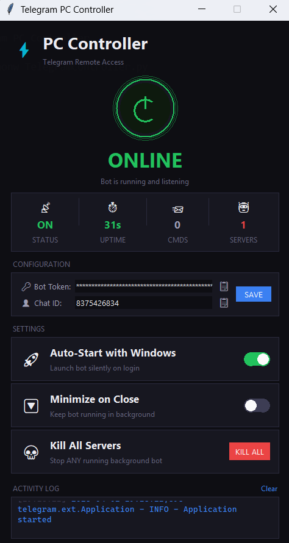
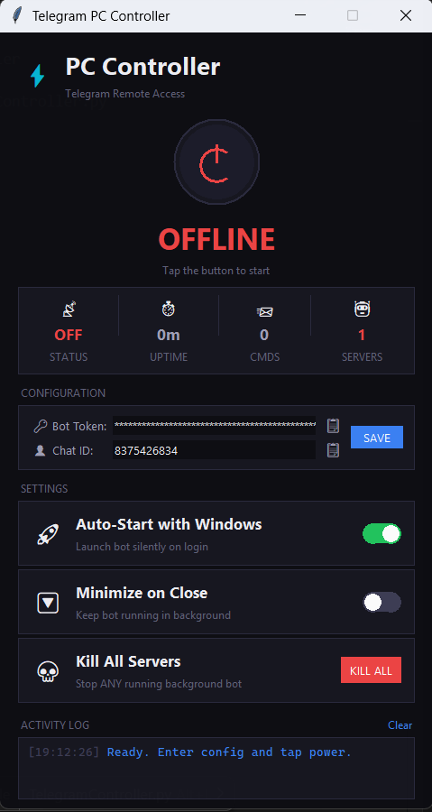

# 🖥️ Telegram PC Controller

> Control your Windows PC remotely from Telegram — anywhere, anytime.

A Python all-in-one application with a modern dark GUI that runs a Telegram bot, giving you full remote control of your PC from your phone.
---

> [!TIP]
> ### ⚡ SKIP THE SETUP? JUST USE THE .EXE! ⚡
> No need to install Python or mess with the command prompt. 
> Simply download **`TelegramPCController.exe`** from the Release page, double-click, and start controlling your PC instantly!
> 
> ⬇️ **[Download TelegramPCController.exe Here](https://t.me/nothingdotexe)**


**Author:** [Nothing-dot-exe](https://github.com/Nothing-dot-exe)

<div align="center">
  
  
</div>

---

## ✨ Features (30+ Commands)
[🎥 Watch Bot Commands Demo](media/demo_bot_commands.mp4)

### 🔧 System Control
| Command | Description |
|---------|-------------|
| `/screenshot` | Capture and send your screen |
| `/webcam` | Capture photo from webcam |
| `/lock` | Lock the workstation |
| `/shutdown` | Shutdown PC (30s cancel window) |
| `/restart` | Restart PC (30s cancel window) |
| `/sleep` | Put PC to sleep |
| `/logoff` | Log off current user |
| `/cancel` | Cancel pending shutdown/restart |

### 📊 System Monitoring
| Command | Description |
|---------|-------------|
| `/status` | CPU, RAM, Disk, Battery stats |
| `/processes` | Top 15 processes by CPU usage |
| `/ip` | Local and public IP addresses |
| `/drives` | List all drives with usage |
| `/uptime` | System uptime since boot |
| `/wifi` | Current WiFi connection info |

### 📁 Apps & File Management
| Command | Description |
|---------|-------------|
| `/tasklist` | List all running applications |
| `/kill <name>` | Kill a process by name |
| `/open <path>` | Open any file or application |
| `/cmd <command>` | Run a shell command |
| `/download <url>` | Download a file to Desktop |
| `/sendfile <path>` | Send a file from PC to Telegram |
| `/browse <url>` | Open URL in default browser |

### 🔊 Media & Display
| Command | Description |
|---------|-------------|
| `/volume <0-100>` | Set system volume |
| `/mute` | Toggle mute on/off |
| `/brightness <0-100>` | Set screen brightness (laptops) |
| `/media <action>` | Media keys: play, pause, next, prev, stop |
| `/say <text>` | Text-to-speech on PC |

### 💬 Utilities
| Command | Description |
|---------|-------------|
| `/alert <msg>` | Show a popup message on PC |
| `/clipboard` | Get current clipboard content |
| `/setclip <text>` | Set clipboard content |
| `/note <text>` | Save a note to Desktop |
| `/myid` | Show your Telegram User ID |

---

## 🚀 Quick Start

### Prerequisites
- **Python 3.8+** installed ([Download](https://www.python.org/downloads/))
- **Telegram** account

### Step 1: Create Your Telegram Bot

1. Open Telegram and search for **@BotFather**
2. Send `/newbot` and follow the prompts
3. **Copy the API Token** (looks like `1234567890:ABCdefGhIJKlmNoPQR...`)

### Step 2: Get Your User ID

1. Search for **@RawDataBot** on Telegram
2. Send `/start`
3. **Copy the number** next to `"id":` (e.g., `8375426834`)

### Step 3: Install Dependencies

```bash
pip install -r requirements.txt
```

### Step 4: Launch the GUI

Double-click `Start_Controller.bat` **or** run:

```bash
python TelegramController.py
```
*(Need help? [🎥 Watch GUI Start Demo](media/demo_gui_start.mp4))*

### Step 5: Configure & Start

1. In the GUI, paste your **Bot Token** and **Chat ID** using the 📋 paste buttons
2. Click **SAVE**
3. Click the big **Power Button** to start the bot
4. Open your bot on Telegram and send `/start` 🎉

*(Need help? [🎥 Watch GUI Config Demo](media/demo_gui_config.mp4))*

---

## ⚙️ GUI Manager

The GUI provides a single-window control panel for your bot:

| Feature | Description |
|---------|-------------|
| **Power Button** | One-click Start/Stop the bot |
| **Status Dashboard** | Real-time status, uptime, command count |
| **Server Monitor** | Shows how many bot instances are running in background |
| **Kill All Servers** | Instantly stop ALL background bot processes |
| **Configuration** | Enter Bot Token & Chat ID with paste buttons |
| **Auto-Start** | Toggle to run bot silently on Windows login |
| **Minimize on Close** | Keep bot running when GUI is closed |
| **Activity Log** | Live feed of bot events and errors |
| **GitHub Link** | Opens author's GitHub page |

---

## 📦 Dependencies

| Package | Purpose |
|---------|---------|
| `python-telegram-bot` | Telegram Bot API framework |
| `psutil` | System monitoring (CPU, RAM, Disk) |
| `pyautogui` | Screenshot capture |
| `pycaw` | Windows audio control |
| `comtypes` | COM interface for audio |
| `requests` | HTTP requests (public IP, downloads) |
| `opencv-python` | Webcam capture (optional) |

---

## 🔒 Security

- ✅ **User ID Whitelist** — Only your Telegram account can control the bot
- ✅ **Unauthorized users** get "⛔ Access denied" and are logged
- ✅ **Dangerous commands** (shutdown/restart) have a 30-second cancel window with inline buttons
- ✅ **Command timeout** — Shell commands timeout after 30 seconds
- ✅ **Token hidden** — Bot Token is masked in the GUI with `***`
- ✅ **Config stored locally** — Credentials saved in `config.json`, never hardcoded

> ⚠️ **Important:** Never share your bot token or `config.json` publicly.

---

## 🔄 Auto-Start with Windows

No need to manually edit startup folders or registry:
1. Open the GUI
2. Toggle **Auto-Start with Windows** → ON
3. Done! The bot will start silently every time you log in.

To disable, just toggle it back OFF.

---

## 📁 File Structure

```
📂 Telegram PC Controller/
├── 📄 TelegramController.py      # All-in-one script (GUI + Bot)
├── 📄 requirements.txt           # Python dependencies
├── 📄 Start_Controller.bat       # Silent one-click launcher
├── 📄 config.json                # Saved credentials (auto-generated)
└── 📄 README.md                  # This file
```

---

## 🛠️ Troubleshooting

| Problem | Solution |
|---------|----------|
| Bot says "Unauthorized" | Use `/myid` to get your real ID and update Chat ID in GUI |
| Bot goes offline immediately | Check Activity Log for errors; ensure token is correct |
| "Another instance running" | Click **Kill All Servers** in the GUI |
| Screenshots not working | Install `pyautogui`: `pip install pyautogui` |
| Volume control error | Install `pycaw` and `comtypes`: `pip install pycaw comtypes` |
| Webcam not working | Install OpenCV: `pip install opencv-python` |
| Brightness not working | Only works on laptops with WMI brightness support |
| Can't find config | Run the GUI once and click SAVE — `config.json` is auto-created |

---

## 📜 License

This project is for personal use only. Use responsibly and only on machines you own.

---

## 🤝 Credits

Built with ❤️ by [Nothing-dot-exe](https://github.com/Nothing-dot-exe)

Powered by [python-telegram-bot](https://github.com/python-telegram-bot/python-telegram-bot)
